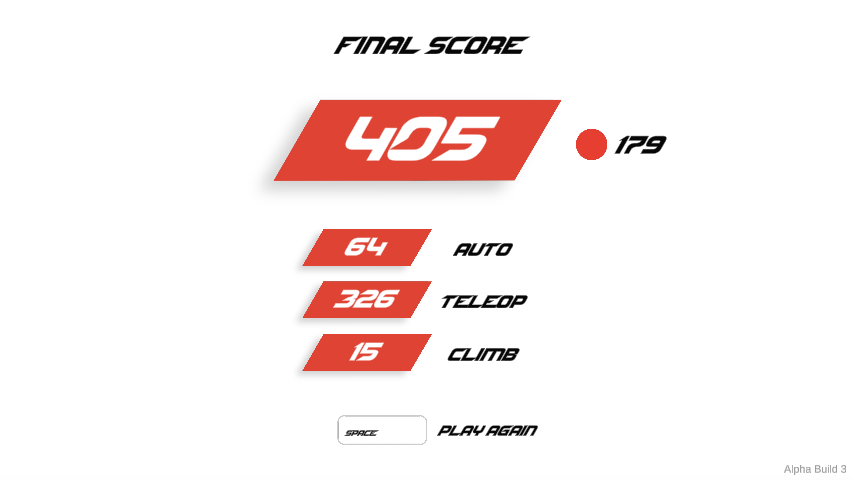

# Machine learning for Roborumble

A trained robot scored 405 points in [RoboRumble](https://corbeng.itch.io/robo-rumble)'s `2022 Singleplayer` mode.

## Record Match

<video controls width="720">
  <source src="405-point-match.mp4" type="video/mp4">
</video>

[Watch the full match](405-point-match.mp4)

## Training

The final model uses a rule-based policy with 22 parameters trained through evolutionary optimization using match score as the fitness signal.

One training cycle:

1. Generate several model variants.
2. Run each on the same three seeds.
3. Rank them by average score.
4. Use the best 25% to generate the next generation.
5. Repeat and save progress.

A typical generation tested 24 models across three matches each. Eight workers trained in parallel using different seeds.

The game itself was not modified: matches remained 15 seconds autonomous and 135 seconds teleop, with normal robot physics and scoring.

## Previous Approaches

Earlier versions attempted to train the robot externally using computer vision and emulated keyboard inputs.

A custom-trained YOLO model tracked the robot and tried to determine its state using the robot's indicator lights. This approach worked, but it was too unreliable for high-level play. Field elements could block the indicator lights, object detection introduced errors, and incorrect state estimates often led to bad actions.

Computer vision was also computationally expensive. Because every game instance required its own visual processing, only a small number of workers could run at once, making training slow.

DQN and PPO models were also tested. These approaches had too many possible observations and actions, which made the learning problem much larger and significantly increased training time.

The final approach simplified both sides of the problem. Instead of learning directly from raw visual observations and every possible control input, the controller reduced the problem to a smaller set of meaningful decisions.

Access to RoboRumble's source code was also very important. It allowed the controller to read the game state directly instead of estimating it through computer vision, removing many sources of error and allowing many more training instances to run in parallel.

## Strategy

The controller attempts to:

- Collect multiple balls per trip.
- Shoot near the edge of shooting range.
- Use three-ball pickup sequences when efficient.
- Approach wall balls from reachable angles.
- Abandon targets when progress stalls.
- Push extra balls toward shooting range when useful.
- Leave enough time to climb.

Training adjusted how strongly these behaviors were preferred.

## Results

The best recorded match scored 405.

Some changes reduced performance. For example, lowering the shooting-range safety margin produced a 359.0 average versus 371.6 for the existing settings on the same seeds.

## Inspiration

This project was heavily inspired by Code Bullet's work using AI and evolutionary methods to train agents to perform game tasks.

A “selection cost” is a number used to compare available balls: the controller picks the lowest cost. Some apply only to particular robot types or only when an option is enabled.

| # | Setting | 405-match value | Allowed range | What it does |
| --- | --- | --- | --- | --- |
| 0 | Shooting-range margin | 0.4205 | 0.08–0.7 | Distance kept inside the game's maximum shooting range when planning shots. The controller compares the projected shooter-to-hub distance with maximum range minus this margin. A larger value brings shooting stops farther inward. |
| 1 | Balls before a shooting stop | 1.5824 | 1–2 | Rounded to one or two balls. After the shooter is activated, this is the load that starts a shooting stop for a stationary shooter inside range. Initial activation and outside-range collection still seek two balls. It also tells target selection when to look for a nearby second ball. |
| 2 | Movement response | 11.4709 | 0.5–12 | Sets the desired speed to the distance from the next waypoint multiplied by this value, capped at the robot's normal top speed. The controller brakes if actual speed exceeds that target by 0.15. Higher values keep it moving faster nearer the waypoint; lower values slow it earlier. |
| 3 | Ball-motion lookahead | 0.1441 | 0–0.8 seconds | Adds the ball's current velocity multiplied by this value to its position when choosing the pickup destination. For example, 0.2 aims where that ball would be after 0.2 seconds if its velocity stayed the same. Zero uses its current position. |
| 4 | Cost of distance from the hub | 0.3651 | 0–3 | Adds this value multiplied by the ball's distance from the hub to its target-selection cost. Larger values favour balls nearer the hub. Zero removes this preference; travel distance and other costs still apply. |
| 5 | Cost of turning toward a pickup | 0.8313 | 0–2 | Adds this value multiplied by the required turn divided by 180 degrees to a ball's selection cost. Larger values favour pickups requiring less turning. When the hub-facing pickup option applies, it uses the turn needed to face the hub instead. |
| 6 | Turning response | 7.632 | 1–20 | Sets the requested turning speed to the angle error in radians multiplied by this value, capped at the robot's normal turning speed. The controller then corrects for current angular velocity. Higher values request a faster turn for the same error. |
| 7 | Drive-input limit | 0.968 | 0.25–1 | Sets the strength of the movement input while accelerating toward a waypoint: 1 is full input and 0.5 is half input. Braking still releases that input. |
| 8 | Preference for the current target | 0.3346 | 0–0.8 | Subtracts this value from the current target's selection cost. Higher values make the robot less likely to switch to another ball for a small advantage. Stalled or unavailable targets are still abandoned. |
| 9 | Climb-time buffer | 0.388 | 0–30 seconds | Starts the climb trip during endgame when time remaining is at most this buffer plus 1.3 times the straight-line distance to the climb zone divided by normal drive speed. Higher values leave earlier. Zero disables the controller's climb departure. |
| 10 | Travel allowed for a third ball | 1.2397 | 0.5–6 | Maximum distance from the robot to a third-ball parking position worth considering when two balls are loaded. The position must be clear and inside shooting range, and the ball must be moving no faster than 0.5 distance units per second. This search applies to robots that stop to shoot. |
| 11 | Pickup parking offset | 0.6784 | 0.64–0.70 | Distance between the ball and the planned robot-centre position, measured toward the hub. Used when parking for a third-ball refill and for the optional hub-facing pickup approach. It places the intake near the ball; it does not directly add a ball to inventory. |
| 12 | Preference for nearby ball pairs | 0.4804 | 0–1.5 | When empty and planning a two-ball trip, adds this value multiplied by the estimated cost of reaching a second ball from each first ball. That estimate includes distance and enabled turning costs. Higher values favour first balls with an easier second pickup. Zero removes this extra preference. |
| 13 | Turn angle that triggers backing up | 45 | 20–45 degrees | During an ordinary pickup, if the target is within 1.3 distance units and the intake needs a turn larger than this angle, the robot backs away to make room. A lower threshold triggers that response sooner. It does not apply during a shooting stop or the hub-facing pickup approach. |
| 14 | Pickup slowdown angle | 91.8987 | 60–160 degrees | Within two distance units of an ordinary pickup, when not backing up, multiplies the movement toward the waypoint by max(0, 1 − absolute intake-angle error / this value). Smaller values reduce the approach more for the same error, giving the robot time to turn. |
| 15 | Extra travel allowed for a sweep | 0.8418 | 0–1.5 | Limits the extra route distance allowed to reach a position for pushing an outside-range ball before the shooting stop. The comparison is robot-to-push-start plus push-start-to-shooting-stop, minus the direct robot-to-stop distance. Values at or below 0.01 skip push planning. For robots that shoot while moving, any positive value also enables a preference for collecting the farther ball first in an outside pair; setting 12 determines how strongly that pair estimate affects target choice. |
| 16 | Planned sweep distance | 1.2655 | 0.5–2.5 | How far beyond the ball the robot aims to drive along the chosen inward push direction. Obstacles, leaving the push line, reaching shooting range, a free cargo slot, or the fixed 2.5-second sweep timeout can end it sooner. It is a movement goal, not a guaranteed ball displacement. |
| 17 | Cost of losing shooter charge | 0.2864 | 0–3 | For robots with a full turret that shoot while moving, while carrying balls and already inside range, adds this value × shooter spin-up time × normal drive speed to a pickup's cost if it leaves range or is estimated to arrive after the loaded supply runs out. This encourages refilling while staying charged. It does not apply to 1678. |
| 18 | Cost of turning before intake | 0.2385 | 0–2 | Adds target-selection cost for the part of an intake turn estimated not to fit into travel before the final 1.3 distance units of the approach. It considers the first pickup and the predicted turn toward a second pickup. Higher values avoid trips with more turning delay; zero removes this estimate. |
| 19 | Cost of aiming after the second pickup | 0 | 0–2 | For robots that stop to shoot, adds selection cost for the predicted turn from the pickup heading toward the hub, after allowing for the turret's normal aiming range. Used when carrying one ball and when estimating a second pickup from an empty robot. Zero disables this added cost. |
| 20 | Hub-facing pickup switch | 0.0908 | 0–1 | Off below 0.5 and on at 0.5 or above. When on, a robot that stops to shoot tries to approach a slow ball from the hub side, keeping its body aimed toward the hub. The planned pickup position must be clear and in range; the ball's speed must be at most 0.5 distance units per second. |
| 21 | Turret allowance when stopping to shoot | 0.021 | 0–1 | For stops without a planned third-ball refill, allows the body heading to remain up to this fraction of the normal turret aiming allowance short of facing the hub exactly, leaving five degrees spare. Zero requests full body alignment. Third-ball stops still require full alignment. Any positive value also checks the actual shooter position is at least 0.025 distance units inside range before holding the stop. |

In this model, setting 1 rounds to two balls, setting 19 is off, and setting 20 is below its 0.5 switch point, so the hub-facing pickup option is off. Setting 17 has no effect on 1678 because that robot does not shoot while moving.

## Source

| File | Purpose |
| --- | --- |
| `PolicyDriver.cs` | Main robot decision-making |
| `PolicyModel.cs` | 22 parameters and training search |
| `FieldNavigator.cs` | Pathfinding and obstacle avoidance |
| `GridNearest.cs` | Finds nearby valid grid positions |
| `PlanarRoute.cs` | Chooses useful ball approach angles |

`PolicyDriver.Update` handles the main decision loop: collecting, shooting, navigation, and climbing.

`PolicyModel` stores the 22 parameter values and uses evolutionary search to improve them.

`FieldNavigator`, `GridNearest`, and `PlanarRoute` handle navigation and ball approach planning.

The match runner, training dashboard, recorder, and original game files are not included.
